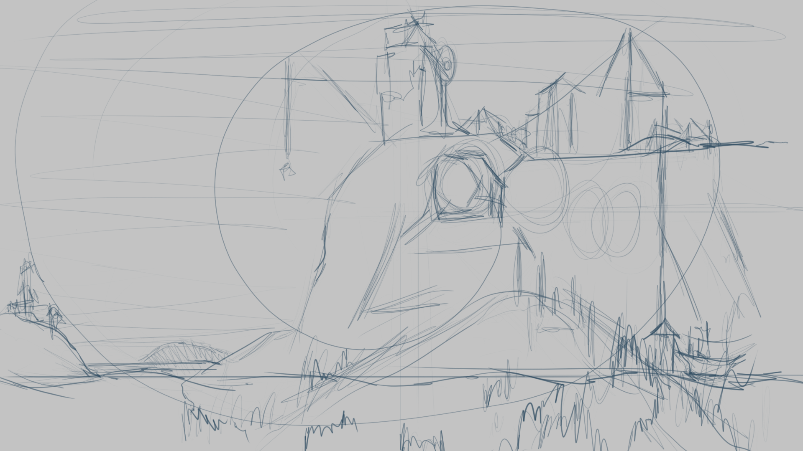
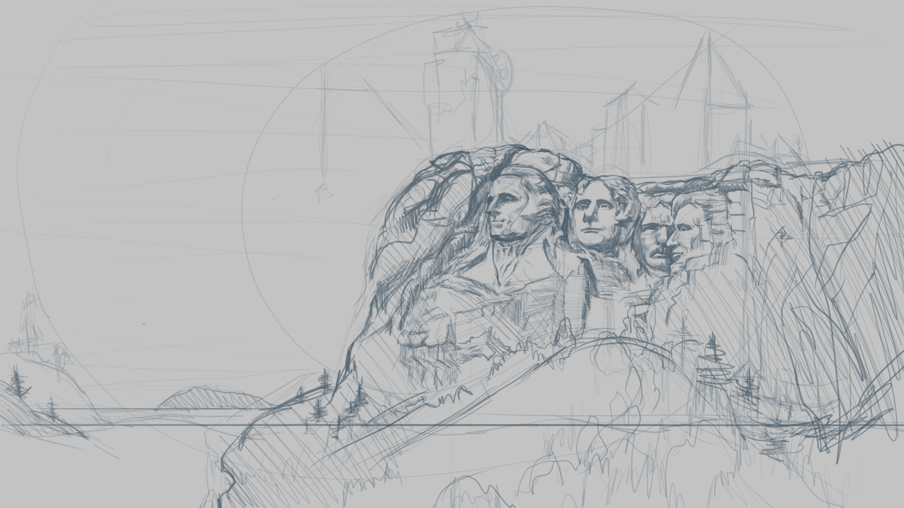
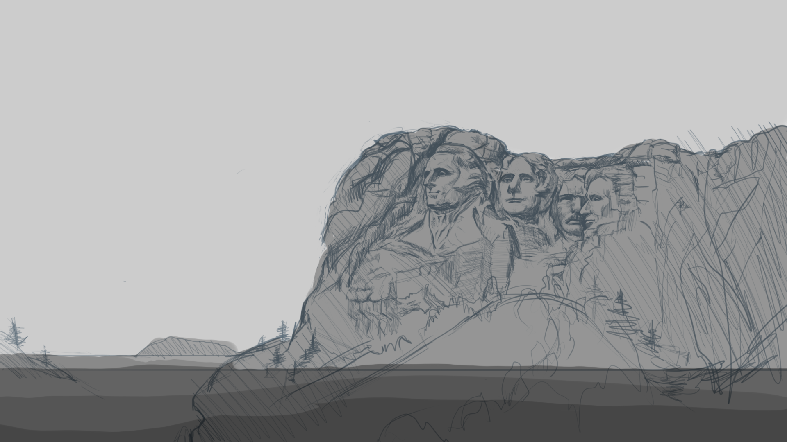
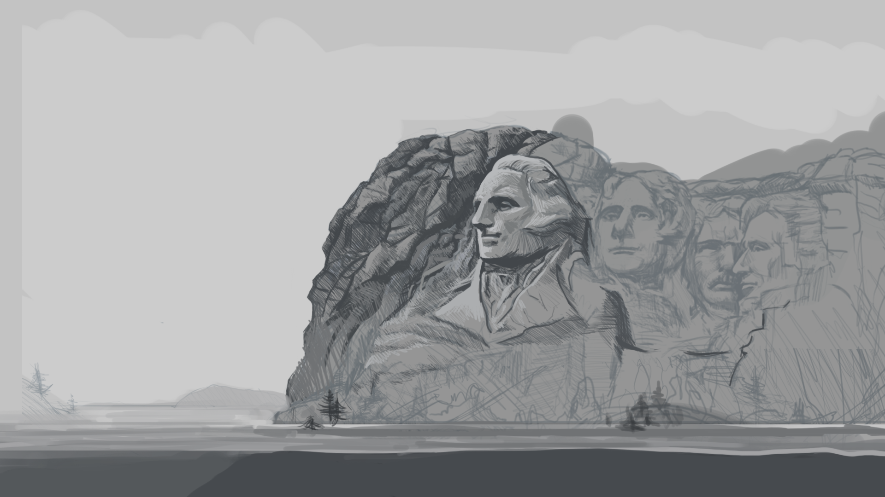

## Table of Contents
```toc
```


## The Process

I explored a few city based ideas before settling on Mt. Rushmore. This is the rough sketch I did to lay out the
overall composition.
It's really just me thinking about the overall spaces that will be divided for the different elements.
I toyed with the idea of having a city on top of the mountain with a crane but eventually scrapped it since
I felt it was distracting from all the fine details in the faces of the Presidents.

### The Rough


### The Drawing


### The Flat Values


### Beginning of the Final Paintover



I adjusted the overall composition and zoomed in on the portraits since I wanted more emphasis there.
Also raised the water level.

### The Final


Here I added the little boat and some subtle sunlight for some color. Balanced out the darks in the rock forms
to frame the portraits and reduced details in other areas to create a better focal point.

I learned quite a bit about how to draw and render rocks with shading that suggests their texture. That was the biggest hurdle for me in this work.
The relief of the rocks looked really bad when I painted with a smooth brush, so I opted for a small 1-2 pixel hard round and just used directional strokes to model them like an ink drawing.

When you need to paint rocks that look and feel hard, forrego the soft brushes altogether. Instead, suggest softness with value transitions of hard strokes.

It was a great process to go through and I really enjoyed it!

<br/>

