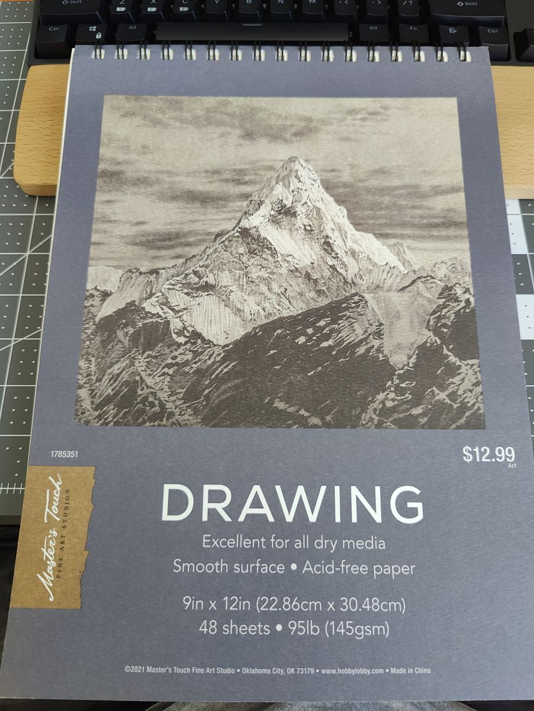
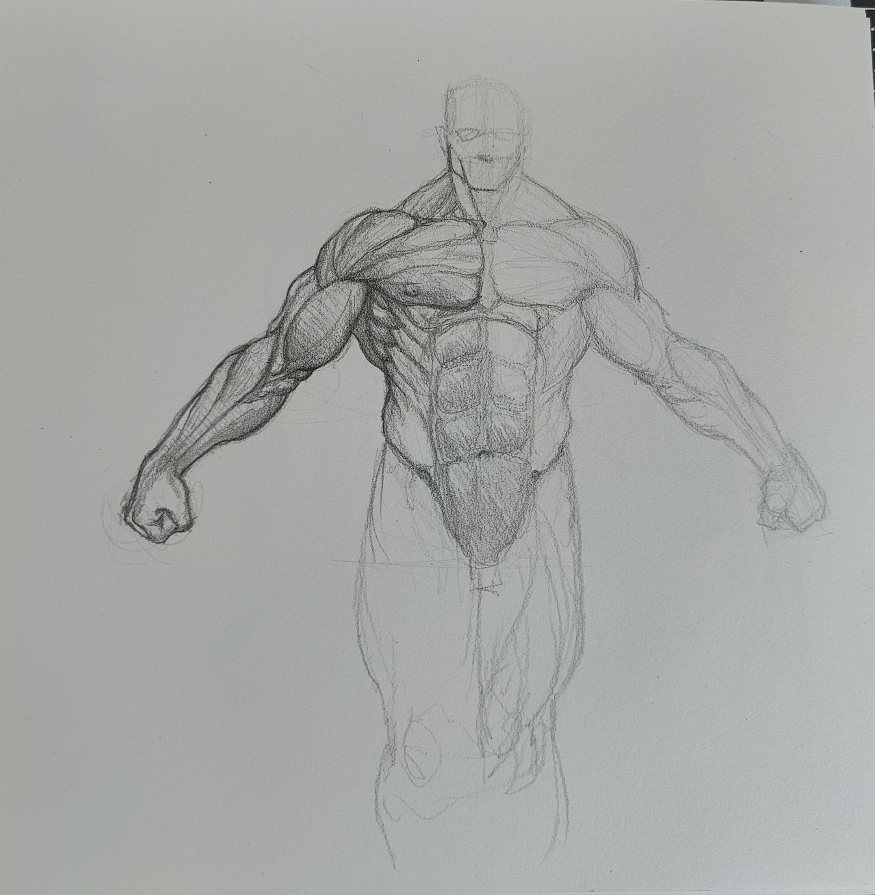
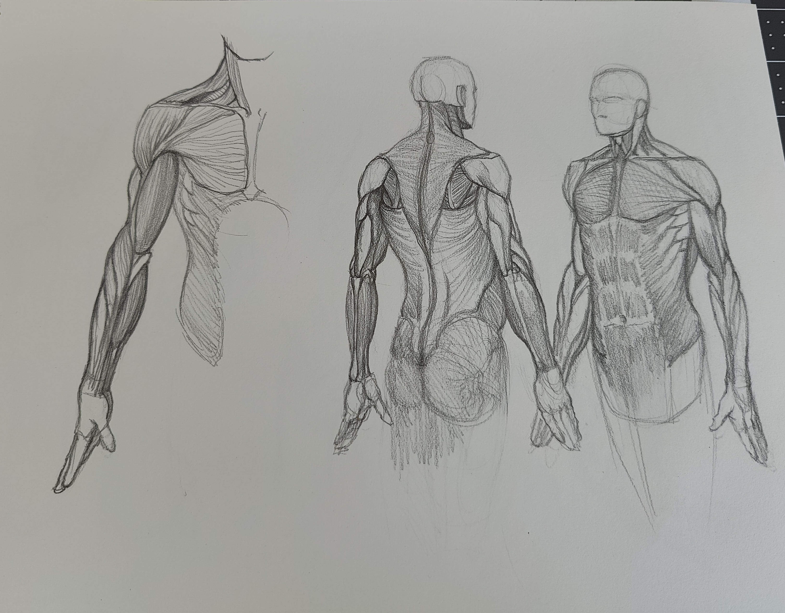

## Table of Contents

```toc
```

<br/>

# A New Sketchbook

While going through Ariel Olivetti's Domestika course on superhero anatomy, I
decided to start a new sketchbook just for anatomy studies. I have an 11x14
wirebound sketchbook that I really like drawing in but I felt like I needed
something with smaller pages.

My criteria for an anatomy sketchbook is the following:

- Smooth paper but with some tooth allowing rendering details in soft pencils.
- Thick enough to allow working with pen and ink if needed without bleeding
  through.
- Small enough to have very low setup time, and to make it faster to fill up a
  page with studies.
- Enough pages to allow a substantial number of drawings.

I found a great 9x12 sketchbook by Master's Touch at Hobby Lobby that met all
these criteria.



# First Study

I used Ariel Olivetti's provided reference for torso studies. They include a
normal human and a superhuman version so we can see the differences.

I drew the superhuman first because that's just me.



I only rendered half of it so I could see parts of the original lay-in and
gesture for future reference. The legs are pretty gestural because they weren't
in the reference, and I just felt them out.

I can see how light I tend to be in the gesture, and how dark when I'm ready to
commit.

The unrendered half shows how shapes really carry a lot of anatomical
information.

Good study. Glad I was able to capture the symmetrical proportions.

</br>

# Second Study

This is the second page of the sketchbook. I worked right to left, since I'm
left handed.

Earlier I used to do one perspetive per page but I think doing multiple
perspectives on the same page is helpful.



Most of the focus was on the arms. You can see the boxy-bucket shaped
abstraction for the pelvis I used in the right-most study. I didn't need to draw
the hands but attempted them anyway because it's always good to practice those.

I didn't want to be too precious with these studies. Making them look good is
secondary to understanding the shapes of the muscles, and the proportions.

But if they're done too carelessly, then they're not helpful for future
reference.

So I allowed myself to use an eraser, and make things look clear, using simple
hatching for the rendering. The rendering also presented an opportunity to
suggest the direction of the muscle fibers.

# Conclusion

Starting a new sketchbook is always fun, but also daunting at times. I didn't
want to ruin the brand new pages with bad drawings! A good way to get around
that fear is to just invest in cheaper sketchbooks, but without compromising too
much on the paper quality. Part of what makes drawing fun is the feel of your
tools on good paper.

Anatomy studies are an opportunity to practice where the subject is already
available and decided.

The focus should be on the gesture, proportions, and structure, working at your
own pace. It takes some patience to get good results.

Studying anatomy might seem boring for beginners but stick with it. Pretty soon,
you'll start to draw the accurate shapes instinctively, and your gestures will
start to have some weight because of the forms you're able to suggest.
