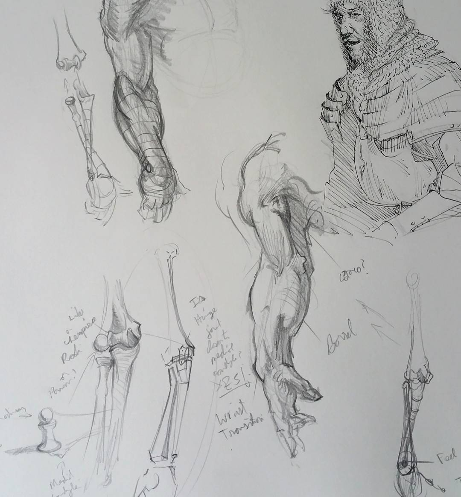
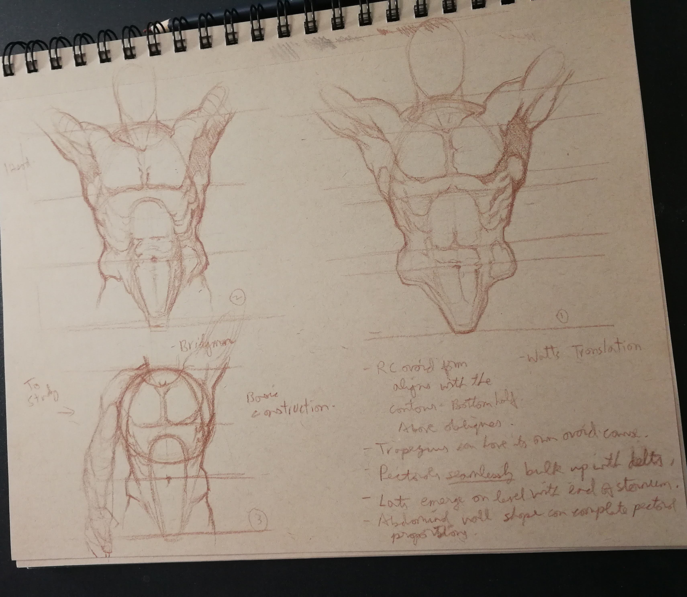
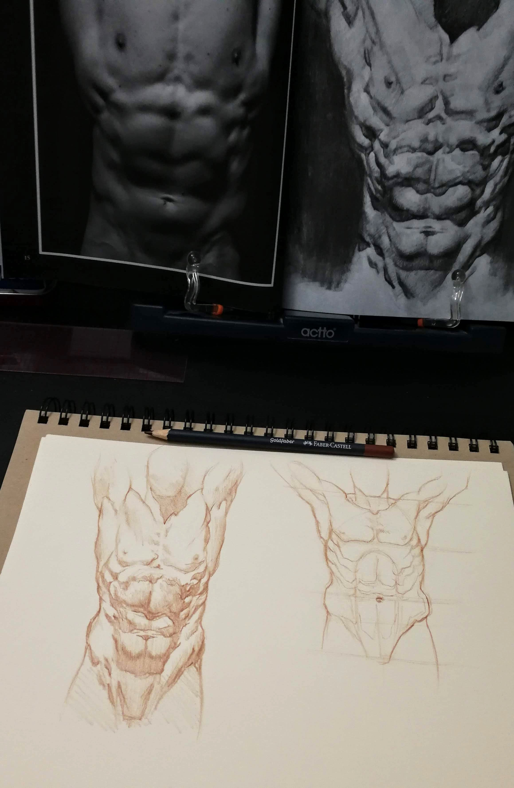
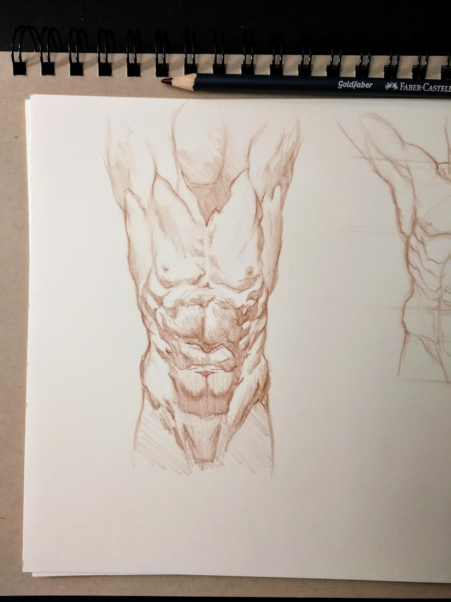

## Table of Contents
```toc
```
<br/>

# Introduction

Human anatomy is a challenging subject. There's quite a lot going on in terms of muscles and the movements they enable.

On the one hand, it's a blessing that there is so much variety in the enexhaustible number of appearances of the human body that it will keep figurative art fresh and interesting for all ages to come. But with this infinite variety comes the challenge of mastering anatomy.

Jeffrey Watts is the founder of [Watts Atelier](https://www.wattsatelier.com/) and one of the best art instructors I've ever seen.
He recently published the book [Watts on Bridgman](https://www.leucadiapublishing.com/) where he interprets the
drawings from Bridgman in his own, beautiful style.

Now that I've received this book, I am so excited to begin another journey through human anatomy.

My plan is to be a little less rigid on the terminology, and more observant of the shape and character of the different muscles. I'll also be documenting my studies on this blog as I proceed through the book, offering my insights and tips.

<br/>

# The Challenge of Bridgman

The artist who wants to be able to invent or construct believable figures would want to know the mechanics and the appearances of the main muscle groups. A beginner's first task is to be able to observe the various undulations of form, becoming familiar with them over time. There's very little invention, and more of adjusting the drawing to what is seen.

Over time, those lumps and bumps along the body start to become _predictable_. This is when the beginner recognizes the _form_ that those bumps represent. Understanding form is the key to figure invention. That is what lets one conjure up figures from imagination with the weight and bulk of real mass.



That's what first attracted me to the drawings of George Bridgman in his book, [Bridgman's Complete Guide to Drawing From Life](https://www.barnesandnoble.com/w/bridgmans-complete-guide-to-drawing-from-life-george-bridgman/1102415539). I was speechless at his graceful, lively and yet massive figures. But like most others, I didn't really know how to learn what was being described in those drawings. I did the best I could in copying his drawings paying attention to how he simplified a complex form to be a simple, descriptive shape. The page above is from my sketchbook from years ago. It shows my attempt at recognizing how the bones fit together, and how the arm muscles are draped on top.

In Bridgman's drawings, every muscle is a form related to others, and its rare to find a single muscle completely delineated like in a scientific anatomy book. This throws off some beginners because the drawings are a complex mixture of anatomical and aesthetic information.

Many of the drawings are often blurry or obscure because of the original scan quality, so that presented another challenge.

This is something Jeffrey Watts addressed in his lectures on figure drawing and anatomy in his online school. He would _reconstruct_ Bridgman's drawing in his own clear and crisp style backed by decades of anatomical knowledge to bridge that gap of understanding faced by the student.

These drawings are now available to everyone to study from and make those leaps of understanding.

<br/>

# Beginning Studying With Watts

Watts encourages students to work from both his book and Bridgman side by side.

His instructions are to draw from Bridgman as the primary source and to use his drawing as clarification for the obscure parts.

I adopted his recommendation and this was my first sheet of drawings.



I used mostly Bridgman but included some of Watt's ingenious and descriptive half tone shapes in the armpit junction.

In my mind, I was not trying to _copy_ Bridgman's drawing on the paper. That's easy to do but it's not as effective. But my focus was on detecting and laying down the simple shapes with a mental perception of form.

In other words, _I'm putting down lines in 2d, but I'm thinking in 3d._ Which is exactly what Bridgman advises when he talks about _mass conception_.

The small diagrammatic construction in the lower left shows how I decided to _contain_ or _scaffold_ the torso for the details in the other drawings.



On this sheet, the drawing on the right was done from imagination, and the drawing on the left was done from the photo reference in Watts' book.

Here's a detail of the photo ref drawing.



I used the photograph for the overall proportions, and Watts' drawing from the photo to guide the shadow shapes and half tones. 

Watts is a masterful designer! He really makes each shape distinctive and purposeful which in the end simplifies the rendering to a great extent. There's no need to add a dozen values. Only two or three will do the job perfectly if the shapes are designed accurate to the forms.

<br/>

# Conclusion

It took me a couple hours to do the studies even though they felt like 30 minutes.

Once you get started, I guarantee it will be difficult to stop. I think Watts and Bridgman are a deadly combination of instructors.

I understood the simplified forms to be able to make a torso from imagination and exercised that information in the drawing from the reference while learning some rendering techniques.

And to think that this is only the first 3 pages from Watts' book and only a single drawing from Bridgman's!

Drawing the other views of the torso will re-inforce these lessons and I look forward to the torsos to come.


